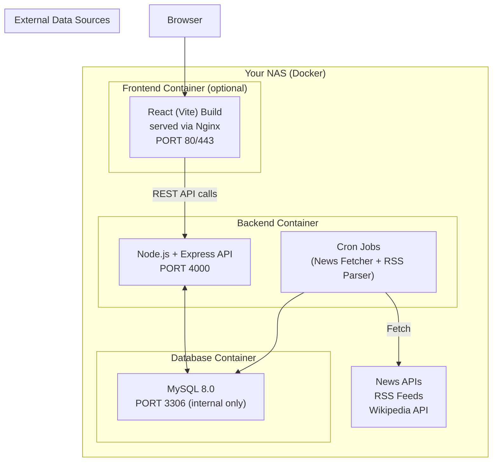

# 24/7 News — Project Architecture & Implementation Plan

A React-based news aggregation platform that pulls categorized news from authentic sources (Ekantipur, BBC, CNN, etc.) and provides a Wikipedia-like articles/knowledge section — all self-hosted on your NAS.

---

## High-Level Architecture



### Three-Tier Stack

| Layer | Technology | Hosted On |
|-------|-----------|-----------|
| **Frontend** | React 19 + Vite + React Router | NAS (Nginx container) or separate host |
| **Backend API** | Node.js + Express.js | NAS (Docker container) |
| **Database** | MySQL 8.0 | NAS (Docker container) |
| **Data Ingestion** | node-cron + rss-parser + axios | Same backend container |

---

## Data Sourcing Strategy

This is the most critical part of your project. You have **4 complementary data channels**:

### 1. RSS Feeds (Free, Legal, Reliable) ⭐ PRIMARY

Most major news outlets publish RSS/Atom feeds. This is the **most legal and stable** method.

| Source | RSS Feed URL (examples) | Categories |
|--------|------------------------|------------|
| BBC News | `http://feeds.bbci.co.uk/news/rss.xml` | World, Business, Tech, Sports |
| CNN | `http://rss.cnn.com/rss/edition.rss` | All |
| Al Jazeera | `https://www.aljazeera.com/xml/rss/all.xml` | World, Politics |
| Reuters | `https://www.reutersagency.com/feed/` | Business, World |
| The Guardian | `https://www.theguardian.com/world/rss` | World, Politics |
| TechCrunch | `https://techcrunch.com/feed/` | Technology |
| ESPN | `https://www.espn.com/espn/rss/news` | Sports |

> [!NOTE]
> **For Ekantipur/Nepali news:** Ekantipur does **not** provide an official RSS feed or API. You'll need either a third-party News API that covers Nepal, or a custom scraper (see below).

**How it works:** A cron job runs every 15-30 minutes, fetches new items from each RSS feed, parses them with `rss-parser`, deduplicates, and stores metadata (title, snippet, link, image, publish date) in MySQL.

### 2. News APIs (Structured, Paid/Free Tiers)

For broader coverage and sources that don't publish RSS:

| API | Free Tier | Best For |
|-----|-----------|----------|
| **GNews API** | 100 req/day, 12h delay | General worldwide news, easy to use |
| **NewsAPI.org** | 100 req/day, 24h delay | Headlines, search, dev/testing only on free |
| **NewsData.io** | 200 req/day | Good Nepal/South Asia coverage |
| **World News API** | 500 req/day | Country-filtered news (`country=np`) |
| **GDELT** | Unlimited (free) | Massive dataset, requires heavy processing |

> [!IMPORTANT]
> **Recommendation:** Start with **GNews API** (easiest) + **NewsData.io** (best Nepal coverage) for dev. Use **RSS feeds as your backbone** for production — they're free, unlimited, and legal.

### 3. Wikipedia API (Free, Unlimited for Articles Section)

For your "articles/knowledge" section — this is **completely free** and very well-documented.

- **Search:** `https://en.wikipedia.org/w/api.php?action=query&list=search&srsearch={query}&format=json&origin=*`
- **Article content:** `https://en.wikipedia.org/w/api.php?action=query&prop=extracts&titles={title}&format=json&origin=*`
- **Summary:** `https://en.wikipedia.org/api/rest_v1/page/summary/{title}`

You can also cache popular articles in your MySQL database for faster loading and offline access.

### 4. Web Scraping (Last Resort, for Nepali Sources)

For sources like Ekantipur that lack feeds/APIs:

- Use **Puppeteer** or **Cheerio** (Node.js) to scrape headlines + snippets
- **Only store:** title, excerpt (first 2 sentences), thumbnail URL, and link to original
- **Never store full articles** (copyright violation)
- Respect `robots.txt` and rate-limit (1 request per 5 seconds minimum)
- Run scraper every 1-2 hours (not aggressively)

> [!WARNING]
> Scraping carries legal risk. Only scrape headlines/snippets, always link to the original, and be prepared to remove a source if they request it.

---

## Database Schema (MySQL)

```sql
-- News source registry
CREATE TABLE sources (
    id INT AUTO_INCREMENT PRIMARY KEY,
    name VARCHAR(100) NOT NULL,            -- 'BBC News', 'Ekantipur'
    slug VARCHAR(50) UNIQUE NOT NULL,       -- 'bbc-news', 'ekantipur'
    base_url VARCHAR(255) NOT NULL,
    logo_url VARCHAR(500),
    feed_url VARCHAR(500),                  -- RSS feed URL (nullable)
    api_source ENUM('rss', 'gnews', 'newsdata', 'scraper', 'wikipedia') DEFAULT 'rss',
    country VARCHAR(5) DEFAULT 'us',        -- ISO country code
    language VARCHAR(5) DEFAULT 'en',
    is_active BOOLEAN DEFAULT TRUE,
    created_at TIMESTAMP DEFAULT CURRENT_TIMESTAMP
);

-- News categories
CREATE TABLE categories (
    id INT AUTO_INCREMENT PRIMARY KEY,
    name VARCHAR(50) NOT NULL,              -- 'Politics', 'Sports', 'Technology'
    slug VARCHAR(50) UNIQUE NOT NULL,       -- 'politics', 'sports', 'technology'
    icon VARCHAR(50),                       -- Icon identifier for frontend
    display_order INT DEFAULT 0
);

-- Core news articles table
CREATE TABLE articles (
    id BIGINT AUTO_INCREMENT PRIMARY KEY,
    source_id INT NOT NULL,
    category_id INT,
    title VARCHAR(500) NOT NULL,
    slug VARCHAR(500),
    excerpt TEXT,                            -- Short snippet (never full article)
    thumbnail_url VARCHAR(1000),
    original_url VARCHAR(1000) NOT NULL,     -- Link back to original source
    author VARCHAR(200),
    published_at DATETIME NOT NULL,
    fetched_at TIMESTAMP DEFAULT CURRENT_TIMESTAMP,
    content_hash VARCHAR(64),               -- SHA-256 for deduplication
    is_breaking BOOLEAN DEFAULT FALSE,
    is_featured BOOLEAN DEFAULT FALSE,
    view_count INT DEFAULT 0,
    
    FOREIGN KEY (source_id) REFERENCES sources(id),
    FOREIGN KEY (category_id) REFERENCES categories(id),
    UNIQUE INDEX idx_content_hash (content_hash),
    INDEX idx_published (published_at DESC),
    INDEX idx_category (category_id, published_at DESC),
    INDEX idx_source (source_id, published_at DESC),
    FULLTEXT INDEX idx_search (title, excerpt)
);

-- Wikipedia/knowledge articles cache
CREATE TABLE knowledge_articles (
    id BIGINT AUTO_INCREMENT PRIMARY KEY,
    wikipedia_page_id BIGINT UNIQUE,
    title VARCHAR(500) NOT NULL,
    summary TEXT,
    content MEDIUMTEXT,                     -- Full Wikipedia extract (permitted by CC license)
    thumbnail_url VARCHAR(1000),
    category VARCHAR(100),
    last_fetched TIMESTAMP DEFAULT CURRENT_TIMESTAMP,
    
    FULLTEXT INDEX idx_knowledge_search (title, summary)
);

-- User accounts (optional, for personalization)
CREATE TABLE users (
    id BIGINT AUTO_INCREMENT PRIMARY KEY,
    email VARCHAR(255) UNIQUE NOT NULL,
    password_hash VARCHAR(255) NOT NULL,
    display_name VARCHAR(100),
    preferred_categories JSON,              -- ['politics', 'sports']
    preferred_sources JSON,                 -- ['bbc-news', 'ekantipur']
    created_at TIMESTAMP DEFAULT CURRENT_TIMESTAMP
);

-- User bookmarks
CREATE TABLE bookmarks (
    id BIGINT AUTO_INCREMENT PRIMARY KEY,
    user_id BIGINT NOT NULL,
    article_id BIGINT,
    knowledge_article_id BIGINT,
    created_at TIMESTAMP DEFAULT CURRENT_TIMESTAMP,
    
    FOREIGN KEY (user_id) REFERENCES users(id) ON DELETE CASCADE,
    FOREIGN KEY (article_id) REFERENCES articles(id) ON DELETE CASCADE,
    FOREIGN KEY (knowledge_article_id) REFERENCES knowledge_articles(id) ON DELETE CASCADE
);

-- Tags for flexible categorization
CREATE TABLE tags (
    id INT AUTO_INCREMENT PRIMARY KEY,
    name VARCHAR(50) UNIQUE NOT NULL
);

CREATE TABLE article_tags (
    article_id BIGINT NOT NULL,
    tag_id INT NOT NULL,
    PRIMARY KEY (article_id, tag_id),
    FOREIGN KEY (article_id) REFERENCES articles(id) ON DELETE CASCADE,
    FOREIGN KEY (tag_id) REFERENCES tags(id) ON DELETE CASCADE
);
```

---

## Backend API Design (Node.js + Express)

### Project Structure

```
server/
├── docker-compose.yml
├── Dockerfile
├── package.json
├── .env
├── src/
│   ├── index.js                  # Entry point
│   ├── config/
│   │   ├── database.js           # MySQL connection pool
│   │   └── env.js                # Environment config
│   ├── routes/
│   │   ├── news.routes.js        # /api/news/*
│   │   ├── categories.routes.js  # /api/categories/*
│   │   ├── sources.routes.js     # /api/sources/*
│   │   ├── articles.routes.js    # /api/articles/* (Wikipedia)
│   │   ├── search.routes.js      # /api/search/*
│   │   └── auth.routes.js        # /api/auth/*
│   ├── controllers/
│   │   ├── news.controller.js
│   │   ├── articles.controller.js
│   │   └── search.controller.js
│   ├── services/
│   │   ├── rss-fetcher.js        # RSS feed parser service
│   │   ├── api-fetcher.js        # GNews/NewsData API service
│   │   ├── scraper.js            # Web scraper for Nepali sources
│   │   ├── wikipedia.js          # Wikipedia API service
│   │   └── deduplication.js      # Content hash + dedup logic
│   ├── jobs/
│   │   ├── scheduler.js          # node-cron job scheduler
│   │   ├── fetch-rss.job.js      # Every 15 min
│   │   ├── fetch-api.job.js      # Every 30 min
│   │   └── cleanup.job.js        # Delete articles older than 30 days
│   └── middleware/
│       ├── auth.js
│       ├── rateLimiter.js
│       └── errorHandler.js
```

### Key API Endpoints

```
GET    /api/news                    # Latest news (paginated, filterable)
GET    /api/news/:id                # Single news article
GET    /api/news/breaking           # Breaking news
GET    /api/news/trending           # Most viewed
GET    /api/categories              # All categories
GET    /api/categories/:slug/news   # News by category
GET    /api/sources                 # All sources
GET    /api/sources/:slug/news      # News by source
GET    /api/articles/search?q=      # Wikipedia article search
GET    /api/articles/:title         # Get full Wikipedia article
GET    /api/articles/trending       # Trending knowledge articles
GET    /api/search?q=&category=     # Full-text search across everything
POST   /api/auth/register           # User registration
POST   /api/auth/login              # User login
GET    /api/bookmarks               # User's bookmarks
POST   /api/bookmarks               # Add bookmark
```

### Key Dependencies

```json
{
  "dependencies": {
    "express": "^5.x",
    "mysql2": "^3.x",
    "rss-parser": "^3.x",
    "node-cron": "^3.x",
    "axios": "^1.x",
    "cheerio": "^1.x",
    "bcryptjs": "^3.x",
    "jsonwebtoken": "^9.x",
    "cors": "^2.x",
    "dotenv": "^16.x",
    "helmet": "^8.x",
    "express-rate-limit": "^7.x",
    "winston": "^3.x",
    "crypto": "built-in"
  }
}
```

---

## React Frontend Structure

### Project Structure (your existing Vite project)

```
src/
├── main.jsx
├── App.jsx
├── index.css                     # Global design tokens
├── assets/
│   └── logo.svg
├── components/
│   ├── layout/
│   │   ├── Navbar.jsx            # Top navigation + search
│   │   ├── Sidebar.jsx           # Category sidebar
│   │   ├── Footer.jsx
│   │   └── Layout.jsx            # Shared layout wrapper
│   ├── news/
│   │   ├── NewsCard.jsx          # Individual news card
│   │   ├── NewsList.jsx          # Grid/list of news cards
│   │   ├── NewsHero.jsx          # Featured/breaking news hero
│   │   ├── BreakingTicker.jsx    # Breaking news ticker bar
│   │   └── SourceBadge.jsx       # Source logo + name
│   ├── articles/
│   │   ├── ArticleCard.jsx       # Knowledge article card
│   │   ├── ArticleView.jsx       # Full article reader
│   │   └── ArticleSearch.jsx     # Search bar for articles
│   ├── common/
│   │   ├── SearchBar.jsx
│   │   ├── CategoryPill.jsx
│   │   ├── SkeletonLoader.jsx
│   │   ├── Pagination.jsx
│   │   └── ErrorBoundary.jsx
│   └── widgets/
│       ├── WeatherWidget.jsx     # Weather sidebar widget
│       ├── TrendingWidget.jsx    # Trending topics
│       └── DateTimeWidget.jsx    # Live date/time
├── pages/
│   ├── HomePage.jsx              # Hero + latest + categories grid
│   ├── CategoryPage.jsx          # News filtered by category
│   ├── SourcePage.jsx            # News filtered by source
│   ├── ArticlePage.jsx           # Single news article detail
│   ├── ArticlesHub.jsx           # Wikipedia articles section
│   ├── ArticleDetailPage.jsx     # Full Wikipedia article view
│   ├── SearchResultsPage.jsx     # Search results
│   ├── BookmarksPage.jsx         # Saved articles
│   └── NotFoundPage.jsx          # 404
├── hooks/
│   ├── useNews.js                # Fetch news with filters
│   ├── useArticles.js            # Wikipedia article hooks
│   ├── useSearch.js              # Debounced search
│   └── useAuth.js                # Auth state management
├── services/
│   ├── api.js                    # Axios instance + base config
│   ├── newsService.js            # News API calls
│   ├── articleService.js         # Article API calls
│   └── authService.js            # Auth API calls
├── context/
│   ├── AuthContext.jsx
│   └── ThemeContext.jsx          # Dark/light mode
└── utils/
    ├── formatDate.js
    ├── truncateText.js
    └── constants.js
```

### Key Pages & UX

#### 🏠 Home Page
- **Breaking News Ticker** — animated horizontal bar at the top
- **Hero Section** — 3-4 featured/breaking stories in a large card carousel
- **Category Tabs** — horizontal scrollable pills (All, Politics, Sports, Tech, etc.)
- **News Grid** — masonry/card grid of latest news, infinite scroll
- **Sidebar** — trending topics, weather widget, date/time

#### 📰 Category Page (`/category/politics`)
- Category banner with icon
- Filtered news grid with source badges
- "Related Articles" from Wikipedia sidebar

#### 📚 Articles Hub (`/articles`)
- Search bar (searches Wikipedia API in real-time)
- Curated topic categories (Science, History, Geography, Politics, etc.)
- Popular articles grid
- Full article reader with clean typography

#### 🔍 Search Results (`/search?q=...`)
- Unified search across both news and articles
- Tabs to switch between "News" and "Articles"
- Filters: date range, source, category

---

## NAS Deployment (Docker Compose)

```yaml
version: '3.8'

services:
  # MySQL Database
  db:
    image: mysql:8.0
    restart: always
    environment:
      MYSQL_ROOT_PASSWORD: ${DB_ROOT_PASSWORD}
      MYSQL_DATABASE: news_aggregator
      MYSQL_USER: ${DB_USER}
      MYSQL_PASSWORD: ${DB_PASSWORD}
    volumes:
      - ./db_data:/var/lib/mysql
      - ./sql/init.sql:/docker-entrypoint-initdb.d/init.sql
    ports:
      - "3306:3306"  # Only expose internally
    networks:
      - news-network

  # Backend API
  api:
    build: ./server
    restart: always
    environment:
      DB_HOST: db
      DB_USER: ${DB_USER}
      DB_PASSWORD: ${DB_PASSWORD}
      DB_NAME: news_aggregator
      JWT_SECRET: ${JWT_SECRET}
      GNEWS_API_KEY: ${GNEWS_API_KEY}
      NEWSDATA_API_KEY: ${NEWSDATA_API_KEY}
    ports:
      - "4000:4000"
    depends_on:
      - db
    networks:
      - news-network

  # Frontend (production build served by Nginx)
  frontend:
    build: ./client
    restart: always
    ports:
      - "80:80"
      - "443:443"
    depends_on:
      - api
    networks:
      - news-network

networks:
  news-network:
    driver: bridge
```

---

## Phased Build Roadmap

### Phase 1 — Foundation (Week 1-2)
- [x] Vite + React project setup (already done)
- [ ] Set up MySQL database on NAS via Docker
- [ ] Create database schema (tables above)
- [ ] Build Express.js API server with basic CRUD routes
- [ ] Implement RSS feed fetcher (BBC, CNN, Guardian)
- [ ] Build basic React frontend: Navbar, HomePage, NewsCard

### Phase 2 — Core Features (Week 3-4)
- [ ] Add GNews/NewsData API integration
- [ ] Implement category filtering & pagination
- [ ] Build CategoryPage, ArticlePage
- [ ] Add full-text search (MySQL FULLTEXT)
- [ ] Add Wikipedia API integration (Articles Hub)
- [ ] Implement breaking news ticker

### Phase 3 — Nepali Sources & Polish (Week 5-6)
- [ ] Build Ekantipur/Nepali source scraper (careful, snippets only)
- [ ] Dark mode / theme switcher
- [ ] Skeleton loaders & micro-animations
- [ ] Responsive design (mobile-first polish)
- [ ] SEO meta tags + Open Graph

### Phase 4 — User Features (Week 7-8)
- [ ] User authentication (JWT)
- [ ] Bookmarks system
- [ ] Personalized feed (preferred categories/sources)
- [ ] Reading history
- [ ] Push notifications for breaking news (optional)

### Phase 5 — Deployment & Optimization (Week 9+)
- [ ] Docker Compose setup for NAS
- [ ] Nginx reverse proxy with SSL
- [ ] Redis caching layer (optional)
- [ ] Performance optimization
- [ ] Content deduplication tuning

---

## User Review Required

> [!IMPORTANT]
> ### Decisions needed before we start building:
> 
> 1. **NAS Brand:** What NAS do you have? (Synology, QNAP, TrueNAS, custom Linux?) — This affects Docker setup and deployment.
> 
> 2. **API Provider:** Should I start with **GNews API** (simplest) or **NewsData.io** (better Nepal coverage)? Or both? Free tiers have 100-200 req/day limits.
> 
> 3. **Scope Priority:** Do you want to start with:
>    - **(A)** Full-stack (backend + frontend together), or
>    - **(B)** Frontend-first (mock data, then connect backend later)?
> 
> 4. **Nepali News:** How important is Ekantipur/Nepali source integration for MVP? (Scraping adds complexity and legal considerations)
> 
> 5. **User Accounts:** Do you need login/bookmarks for the initial version, or is a read-only news reader sufficient for MVP?
> 
> 6. **Hosting:** Will this be accessed only on your local network, or do you want it publicly accessible via a domain?

---

## Verification Plan

### Automated Tests
- Backend: Jest + Supertest for API endpoint testing
- Frontend: React Testing Library for component tests
- Database: Integration tests against a test MySQL container

### Manual Verification
- Visual review of all pages in browser (desktop + mobile)
- Test RSS feed ingestion with live BBC/CNN feeds
- Verify Wikipedia API article fetching and display
- Load testing with multiple concurrent users
- Verify Docker deployment on NAS
